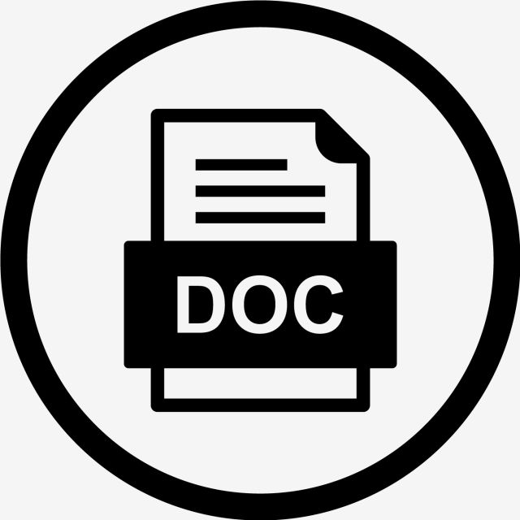

## Getting Started

<a name="readme-top"></a>

<!--
HOW TO USE:
This is an example of how you may give instructions on setting up your project locally.

Modify this file to match your project and remove sections that don't apply.

REQUIRED SECTIONS:
- Table of Contents
- About the Project
  - Built With
  - Live Demo
- Getting Started
- Authors
- Future Features
- Contributing
- Show your support
- Acknowledgements
- License

After you're finished please remove all the comments and instructions!
-->


<!-- TABLE OF CONTENTS -->

# 📗 Table of Contents

- [📖 About the Project](#about-project)
  - [🛠 Built With](#built-with)
    - [Tech Stack](#tech-stack)
    - [Key Features](#key-features)
- [💻 Getting Started](#getting-started)
  - [Setup](#setup)
  - [Prerequisites](#prerequisites)
  - [Install](#install)
- [👥 Authors](#authors)
- [🔭 Future Features](#future-features)
- [🤝 Contributing](#contributing)
- [⭐️ Show your support](#support)
- [🙏 Acknowledgements](#acknowledgements)
- [❓ FAQ](#faq)
- [📝 License](#license)

<!-- PROJECT DESCRIPTION -->

# 📖 ISO Documentation <a name="about-project"></a>


**ISO Documentation**  is a robust web application specifically designed to streamline the storage and management of diverse document types. From manuals and procedures to guidelines, organizational standards, and criteria documents, this user-friendly platform effortlessly handles documents in various formats. With a powerful database at its core, ISO Documentation enables easy organization and retrieval of documents. Users can swiftly search through the repository using filters such as department, date, category, and more. Whether you need to access a specific manual or locate a procedure document, ISO Documentation simplifies the process, saving valuable time and increasing productivity. Say goodbye to manual document tracking and embrace the efficiency and convenience of ISO Documentation for all your document management needs.

## 🛠 Built With <a name="built-with"></a>

### Tech Stack <a name="tech-stack"></a>

> 

<details>
  <summary>Database</summary>
  <ul>
    <li><a href="https://www.microsoft.com/en-us/sql-server/">SQL</a></li>
  </ul>
</details>
<details>
  <summary>Python3</summary>
  <ul>
    <li><a href="https://www.python.org/">Python</a></li>
  </ul>
</details>
<details>
  <summary>Flask</summary>
  <ul>
    <li><a href="https://flask.palletsprojects.com/">Flask</a></li>
  </ul>
</details>
<details>
  <summary>Redis</summary>
  <ul>
    <li><a href="https://redis.io/">Redis</a></li>
  </ul>
</details>
<details>
  <summary>React</summary>
  <ul>
    <li><a href="https://redis.io/">React</a></li>
  </ul>
</details>
<details>
  <summary>Redux</summary>
  <ul>
    <li><a href="https://redux.js.org/">Redux</a></li>
  </ul>
</details>


<!-- Features -->

<p align="right">(<a href="#readme-top">back to top</a>)</p>

### Key Features <a name="key-features"></a>

The web app includes the following features:

- **Register user**
- **Disable user**
- **Add document**
- **Remove document**
- **Add revision**
- **Preview document**
- **Lookup document based on data, uploader, department, category**
- **Download document**

<p align="right">(<a href="#readme-top">back to top</a>)</p>

<!-- GETTING STARTED -->

## 💻 Getting Started <a name="getting-started"></a>

### Prerequisites

Before you run the application:
  - Make sure MS SQL is installed
  - The right user and database are added.
<!--
Example command:

```sh
 gem install rails
```
 -->

### Setup
Clone the repository to desired directory on local computer.
> `git clone https://github.com/wacoo/iso-documentation-flask--react`

> `cd iso-documentation-flask--react`
> `npm install`

To run the react frontend:
> `npm start`
To run flask backend:
> `cd server`

> `python3 run.py`

## 👥 Author <a name="authors"></a>

- GitHub: [@wacoo](https://github.com/wacoo)
- Twitter: [@wabaham9](https://twitter.com/wabaham9)
- LinkedIn: [LinkedIn](https://linkedin.com/in/wondmagegn-abriham-b867289a)

<p align="right">(<a href="#readme-top">back to top</a>)</p>

<!-- FUTURE FEATURES -->

## 🔭 Future Features <a name="future-features"></a>
- Expand its functionalities to the whole organization
- Increase its usability
- Increase its userfriendliness
<p align="right">(<a href="#readme-top">back to top</a>)</p>

<!-- CONTRIBUTING -->

## 🤝 Contributing <a name="contributing"></a>

Contributions, issues, and feature requests are welcome!

Feel free to check the [issues page](../../issues/).

<p align="right">(<a href="#readme-top">back to top</a>)</p>

<!-- SUPPORT -->

## ⭐️ Show your support <a name="support"></a>

- Please support me by contributine to this project.

<p align="right">(<a href="#readme-top">back to top</a>)</p>

<!-- ACKNOWLEDGEMENTS -->

## 🙏 Acknowledgments <a name="acknowledgements"></a>
- I would like to thank you in advance for any contribution you make to this project.

<p align="right">(<a href="#readme-top">back to top</a>)</p>

<!-- FAQ (optional) -->

## ❓ FAQ (OPTIONAL) <a name="faq"></a>
- **How can I find you?**

  - Please find my contact information below.

- **Can you give me a price range for your services?**

  - To get price range, please contact us with: wabaham9@gmail.com

<p align="right">(<a href="#readme-top">back to top</a>)</p>

<!-- LICENSE -->

## 📝 License <a name="license"></a>

This project is [MIT](MIT.md) licensed.

<p align="right">(<a href="#readme-top">back to top</a>)</p>
